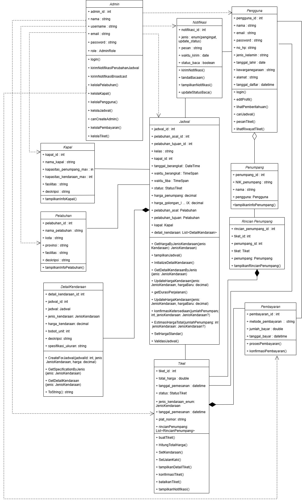
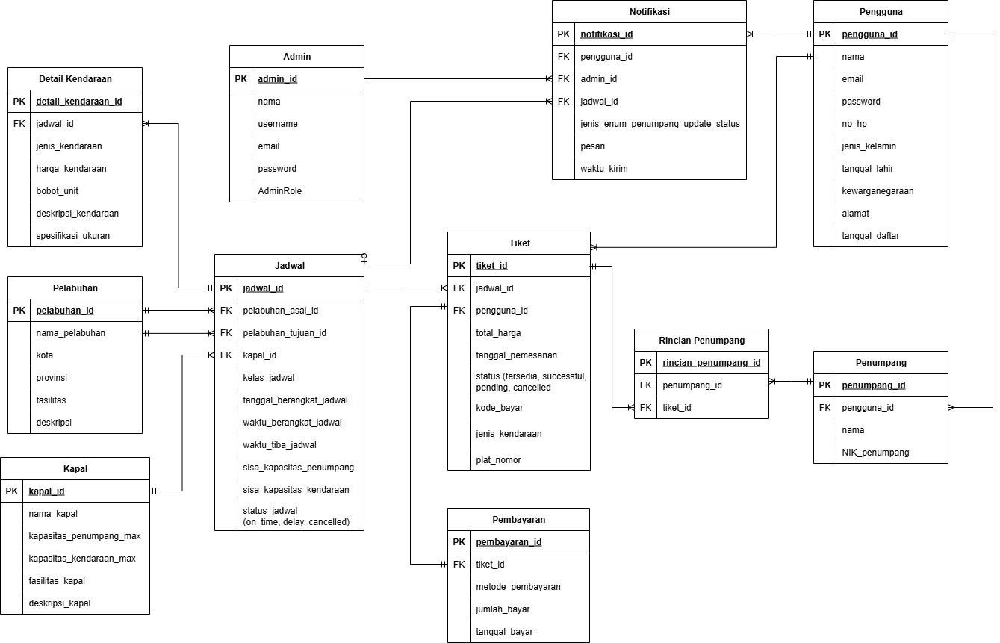

# 🚢 TiketLaut - Aplikasi Tiket Kapal Laut
Nggak perlu lagi antre panjang di pelabuhan atau bingung cari jadwal kapal. Dengan KapalKlik (TiketLaut), kamu bisa cek jadwal, pilih rute, booking tiket, sampai bayar, all in one click!

## 👥 Tim Pengembang - Ikan Asap Pak Be
| Jabatan           | Nama                                   | NIM                |
|-------------------|----------------------------------------|--------------------|
| Ketua Kelompok    | Benjamin Sigit                         | 23/514737/TK/56513 |
| Anggota 1         | Rafeyfa Asyla                          | 23/512856/TK/56361 |
| Anggota 2         | Chaira Nastya Warestri                 | 23/514942/TK/56550 |

## 📋 Deskripsi Aplikasi
**Nama Aplikasi:** KapalKlik (Tiket Kapal Laut)  
**Kategori:** Ticketing  
**Tipe Aplikasi:** WPF (Console App untuk demo)  
**Repository:** https://github.com/benjminn/TiketLaut

## 🎯 Permasalahan yang Dipecahkan
1. **Antre Panjang:** Penumpang harus antre lama di pelabuhan untuk membeli tiket secara langsung
2. **Kurang Informasi:** Kurangnya informasi tentang lokasi pelabuhan, akses transportasi, dan fasilitas pendukung
3. **Update Real-time:** Penumpang tidak mendapatkan informasi cepat tentang keterlambatan atau perubahan jadwal
4. **Reminder:** Banyak penumpang yang lupa jadwal keberangkatan

## ✨ Fitur Utama
1. **🎫 Booking System:** RESTful API untuk pemesanan tiket kapal
2. **👤 Role-Based Access:** SuperAdmin dan OperationAdmin dengan permission berbeda
3. **🗃️ Database Integration:** Supabase PostgreSQL dengan Entity Framework Core
4. **📊 Real-time Data:** Jadwal, harga, dan ketersediaan kursi
5. **📱 Notification System:** Push notification untuk update jadwal

## How To Run �🏻‍♂️

Masukan perintah berikut ke dalam terminal
```
cd TiketLaut
dotnet run

dotnet build #untuk build
```

## Pull & Push Schema 💪🏻

1. Checkout to main branch
2. Pull origin main
3. Create a new branch (Please read the rule below this section)
4. Checkout to the new branch
5. Code
6. Commit (Please follow the commit messages rule)
7. Pull origin main
8. Push origin "your branch name"
9. Create a new pull request to main branch and merge
10. Done

## Branch Naming ✏️

`<type>/<short_description>.<nama_kamu>`

- `<type>` :
  - feature: saya menambahkan fitur baru
  - fixing: saya memperbaiki fitur

Contoh: feature/navbar.benjamin

## Commit message 📝

`<type>(<scope>): <short_summary>`

- `<type>` :
  - feat: saya menambahkan fitur baru
  - fix: saya memperbaiki fitur

- `<scope>` : ini opsional
- `<short_summary>` : buat sejelas mungkin

Contoh: feat(api): Creating booking endpoint

## Folder Structure 📁

```
- Models: Entity models untuk database
- Services: Business logic dan service layer
- Controllers: API endpoints dan routing
- Data: Database context dan migrations
- docs: everything related to documentation
```

## Aturan Penulisan Variabel / File 📃

- Gunakan **PascalCase** untuk menulis nama class / controller / model
  AdminController.cs, TiketModel.cs
- Gunakan **camelCase** untuk menulis nama variabel / method parameter
  userId, jadwalId, getTiketById, dkk
- Selalu gunakan .cs file untuk C# code!

## Notes 📰

- Kalo branch mu udah di merge, jangan lupa juga buat hapus branch mu dari github (biar rapi :>)
- API Documentation tersedia di Swagger UI: http://localhost:5000
- Database menggunakan Supabase PostgreSQL dengan auto-migration


## Class Diagram

Berikut adalah rancangan class diagram yang dibuat

<div style="text-align: center;">
  
</div>

## Entity Relation Diagram

Berikut adalah rancangan erd yang dibuat

<div style="text-align: center;">
  
</div>

